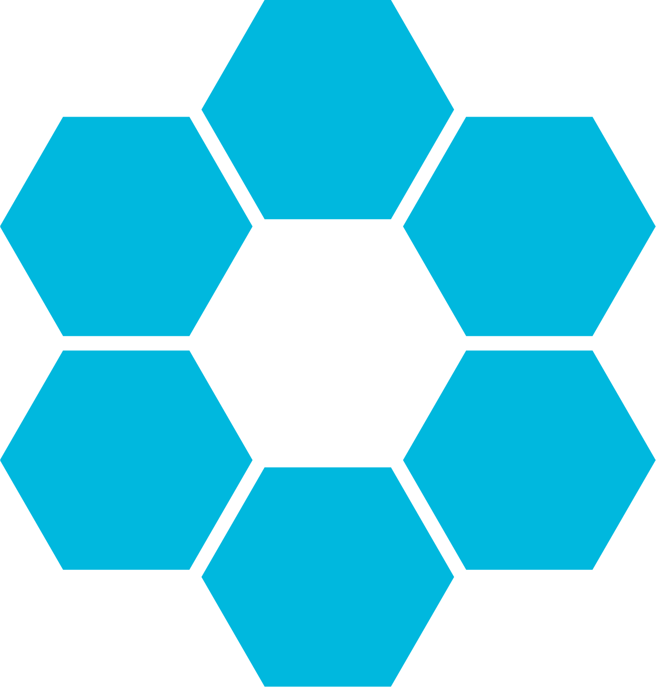
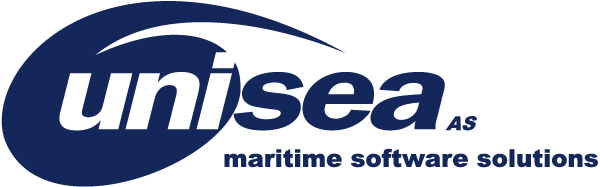
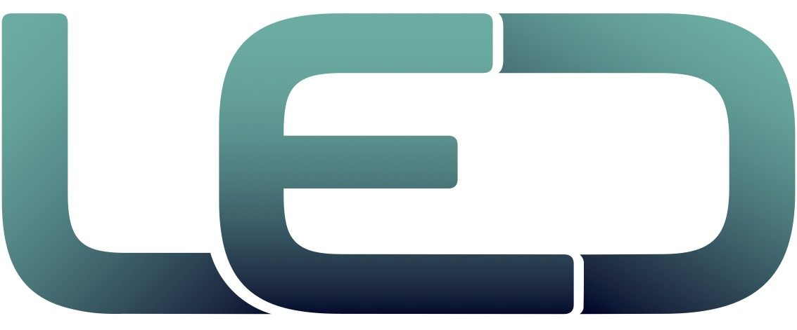

### Hi there 👋
I'm Martin, and I study computer engineering on a bachelor level at the  <a href="https://www.uis.no/en">()University of Stavanger</a> in Norway.

<h3 align="left">Experience</h3>
I worked for a year at the student organization <a href="https://ionracing.no/">  ION Racing</a> developing software for the team and the formula student car, 
with my main focus on front-end developing for the website

I'm also part-time employed as a Software Developer trainee at <a href="https://unisea.no/">() Unisea AS</a>.  
My work here is full-stack development using the angular framework for front-end and java for back-end implementations.

<h3 align="left">Awards</h3>
I was awarded the <strong>Coder of the Year</strong> award by the 
line association <a href="https://www.led-uis.no/">() LED</a> for scoring the highest on their <a href="https://adventofcode.com/">  AoC<a> leaderboard for 2022

<h3 align="left">Languages and Tools:</h3>

                                

<!--
**MslRobo/MslRobo** is a ✨ _special_ ✨ repository because its `README.md` (this file) appears on your GitHub profile.

Here are some ideas to get you started:

- 🔭 I’m currently working on ...
- 🌱 I’m currently learning ...
- 👯 I’m looking to collaborate on ...
- 🤔 I’m looking for help with ...
- 💬 Ask me about ...
- 📫 How to reach me: ...
- 😄 Pronouns: ...
- ⚡ Fun fact: ...
-->
